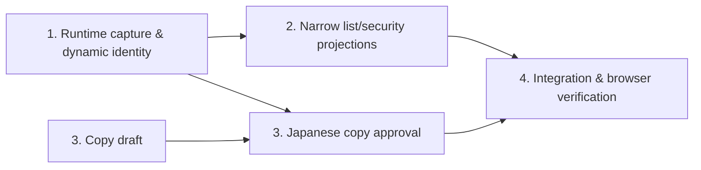

# Issue #29 — 最初の post-PEOF 日本語 gameplay milestone

**結論:** 次の milestone は **Simulation Mode への初回移行と、最初の短い記録 loop** とする。境界は fresh session の `PEOF` から simulation 開放通知を受け、`ENTER SIMULATION MODE`、canonical security challenge への正答、初期地点の `LOOK`、`RECORD` → `WAIT` → `RECORD OFF` を完了して通常の line input が戻るところまでである。

これは設計判断だけを記録する文書であり、translation、catalog、projector、runtime、story artifact の動作は変更しない。

## 調査方法と証拠の範囲

2026-09-07 に、canonical Release 79 (`public/amfv-r79-s851122.z4`) を Parchment で起動した fresh browser context を候補ごとに作り、canonical English command を送った。各 turn 後に bridge-v3 の `lines` / `runs` / `activeInput` と Parchment の `GridWindow` text を採取した。重大候補について観測した経路は次のとおり。

- PEOF depth: `PEOF`, `LOOK`, `EXAMINE DESK`, `EXAMINE DR PERELMAN`, `EXAMINE DECODER`, `EXAMINE MAP`, `EXAMINE PEN`, `EXAMINE MAGAZINE ARTICLE`。この deterministic packet は Issue #30 で既に runtime fixture と catalog に統合済みである。
- Communications breadth: fresh context から `PCAF`, `MACO`, `RCRO`, `PPCC`, `WNNF` をそれぞれ直接送信した。
- Main-flow: `PEOF`, `WAIT` × 4, `ENTER SIMULATION MODE`, security challenge の decoder 正答, `LOOK`, `RECORD`, `WAIT`, `RECORD OFF`。

観測値は source から合成していない。source は観測後に branch の理由を説明し、未観測 branch を洗い出すためだけに参照した (`source/prism.zil` の message/security/simulation routines、`source/interrupts.zil` の Perelman clock events)。一時的な capture harness は製品・test suite に残していない。

## 観測した候補 matrix

| 候補 | fresh runtime で観測した player-facing shape | 既存 presentation での分類 | player value | volume / variability / test cost | 判断 |
| --- | --- | --- | --- | --- | --- |
| **PEOF depth** | command echo、office heading、通常 prose、blank paragraph、`>` line input。既存 inspection packet の後、`WAIT` では `Time passes...` に加えて secretary / Perelman の timed scene が同じ普通の prose leaf として割り込む | inspection は specialized projection 不要の **ordinary observed-line turn** として既に表現可能・翻訳済み。会話も見た目は ordinary だが time/state branch が広い | 現在の場面への愛着は増すが、新しい game system を開かない | 既存 deterministic volume は小。次の会話面は時刻、人物位置、質問状態、interrupt に依存し catalog/test が急増 | 大 milestone にはしない。将来、個別の会話 intent を一つずつ切る |
| **Communications breadth** | 全 outlet が `>CODE` → heading/prose → blank → line input。WNNF は network hook-up prose の後に広告 feed、PPCC/PCAF/RCRO/MACO は各 scene description。Grid status は `COMMUNICATIONS MODE` のまま location が切り替わる | heading/prose 自体は **ordinary observed-line turn**。status/location は既存 wrapper observation。新 renderer は不要 | 世界の広さを早く見せるが、見るだけの横展開で main objective は進まない | PPCC は観測でも source でも確率分岐、WNNF は feed/day/time state、PCAF は人物・会話、MACO は機器状態、RCRO は時刻/天候等の変動を持つ。全 outlet 一括は translation と fixtures が大きい | 次点。後続は outlet ごとに独立させ、一括 milestone にしない |
| **Main-flow progress** | 4 回目の `WAIT` で private-line prose、9 項目の indented recording list、blank boundaries、Perelman の退場/復帰。`ENTER SIMULATION MODE` で status が mode=`SIMULATION MODE`, location=`(UNDEFINED)` へ変わり、random color/inner number の security prompt（同じ line input）を表示。正答後、status は random date/time の 2041 `KENNEDY PARK` へ変わり、heading + prose + blank + line input。`RECORD` / `RECORD OFF` は通常 prose、Grid status だけ `(RECORDING)` を付外しする | 通知の surrounding prose、初期 scene、record messages は **ordinary observed-line path**。9-item assignment list と active input と同じ leaf に同居する security prompt は **structurally richer** であり、それぞれ narrow specialized story projection が必要。command-deck の assisted security decoder は story projection ではない。mode/location/recording は既存 status observer | 物語の目的（未来を観測し記録する）を初めて実行でき、最小の end-to-end loop になる | copy は secretary/Perelman timed leaves + 通知 + 9 list items + security shell + Kennedy Park + record messages に限定可能。challenge、simulation month/day/time は dynamic だが identity と期待値を明示して test できる。初期地点は fresh first simulation で固定 | **推奨** |

### 構造上の観測

- 全 capture で canonical command echo は English のまま独立 leaf だった。response 後は `activeInput.kind = "line"` に戻った。今回の範囲に character-input transition はなかった。
- Fresh capture の assignment run は `Eating a meal` から `Visiting your own home or living quarters` まで **9 leaves** だった。message routine の odd indices 1..17 という historical enumeration と一致し、9件すべてを一つの list boundary 内で保持する必要がある。
- Security challenge は Parchment 上では一つの prompt line に challenge と textarea が同居し、bridge-v3 では narrow layout による語ごとの run/newline が見えた。これは geometry を翻訳 identity にしてはならない具体例である。既存 `parseSecurityChallenge` / security-decoder は assisted interaction level の command-deck control にすぎず、localized story surface の projection ではない。ordinary projector は active-input line の直前までを切り出すため、この prompt 自体を表示できず、Classic には補助 decoder もない。したがって dynamic challenge shell と canonical values を保持する narrow story projection、または明示的 canonical-surface recovery が必要である。本 milestone は end-to-end 日本語表示を目指すため、前者を follow-up design dependency とする。
- 初回 simulation の観測例では challenge は `BLACK 60` / answer `78` だったが、色・inner number・answer は fresh run ごとに変わる。正答後の例は `Kennedy Park`, 2/10/2041, 11:16AM で、date/time も random だった。一方、初回が 10 years hence / 2041 で Kennedy Park から始まることは observed flow と historical branch enumeration が一致した。
- `RECORD` 後、Grid mode は `SIMULATION MODE (RECORDING)`、`RECORD OFF` 後は `SIMULATION MODE` に戻った。buffer はそれぞれ `Record feature activated.` / `Record feature deactivated.` という普通の prose turn で、間の `WAIT` は `Time passes...` だった。
- PEOF で待機した観測では status time が 7:07PM → 7:17PM → 7:19PM → 7:29PM → 7:35PM と進んだ。2 回目は secretary interrupt、4 回目は simulation-ready message によって 10 分未満で中断された。したがって「4 回の WAIT」はこの fresh observed route の再現手順であって、一般化された時刻条件ではない。

## 推奨 milestone の正確な fresh-session path

1. 新しい canonical Release 79 session を開始し、opening の character prompt に任意の一文字を送って最初の Communications Mode line input まで進む。
2. `PEOF` を送る。status は `COMMUNICATIONS MODE / DR. PERELMAN'S OFFICE` になる。
3. `WAIT` を 4 回送る。各 echo と `Time passes...` を保持する。観測した session では 2 回目に secretary scene、4 回目に official private-line message が発火した。
4. 次の通知を milestone に含める: Plan parameters completion、Simulation Mode availability、9 件の「things to record」、real-time 説明、PEOF で見えているため必ず出る Perelman leaves/returns prose。通知後は line input に戻る。
5. `ENTER SIMULATION MODE` を送る。Grid は一時的に `SIMULATION MODE / (UNDEFINED)`。表示された random `COLOR + inner number` に対する canonical decoder の outer number を **英数字の canonical input** として送る（誤答 branch は今回含めない）。
6. 正答後の `This simulation is based 10 years hence.` と `Kennedy Park` の heading/description を表示する。random month/day/time は翻訳 key に含めず status の canonical observation として扱う。
7. `LOOK`、`RECORD`、`WAIT`、`RECORD OFF` の順に送る。Kennedy Park scene の再表示、record activation、ordinary wait、record deactivationを表示し、Grid の `(RECORDING)` transition と最後の line input recovery を確認して境界とする。

この経路は player が「brief を受ける → security を通る → 未来を観測する → 記録を開始/停止する」という一つの coherent action を完了する。単なる別 camera の翻訳より player-facing frontier として価値が高く、最初の移動や task completion を入れないことで review 可能な大きさに保てる。

## follow-up Issues（review 後にのみ作成）

### 1. `Capture the first Simulation Mode transition and recording loop`

- **Scope:** 上記 exact path の bridge-v3 turn slices と real-browser observations を sanitized runtime fixtures にする。4 回の `WAIT`（secretary scene を含む）、通知前後の Perelman leaves/returns、通知 prose、9 assignment leaves、security prompt と active input、正答後 scene、`LOOK`、record on/wait/off、status/input transition を別 identity で記録する。
- **Dependencies:** なし。最初に実施する。
- **Acceptance boundary:** canonical English only。9 assignments をすべて数えて保持する。random challenge と random date/time を少なくとも複数 fresh sessions で確認し、stable leaf と dynamic fields を区別する。誤答、追加 WAIT、移動、record中の事件は含めない。canonical checksum を確認する。

### 2. `Design narrow projections for the simulation brief and security prompt`

- **Scope:** runtime fixture に基づき、(a) indented 9-assignment run を一つの semantic `list` block として順序・list boundary・canonical identity ごと保持する projection、(b) active-input line に同居する security shell を dynamic color/inner number/answer と分離し、Classic を含む localized story surface に提示する projectionを設計・testする。既存 assisted decoder は入力補助として再利用できるが story output の代替とはしない。
- **Dependencies:** Follow-up 1。
- **Acceptance boundary:** この2つの observed shape だけに限定する。leading indentation を ordinary `clean()` に渡して失わない。security values と送信値は canonical のまま、未知形は original-English canonical surface へ fail closed する。general list/security framework、GridWindow renderer、geometry identity は作らない。

### 3. `Translate the first simulation brief and Kennedy Park recording loop`

- **Scope:** Follow-up 1 で確定した stable English leavesだけの日本語 copy。4 `WAIT` の ordinary response、secretary scene、Perelman leaves/returns、private-line brief、**9 assignment leavesすべて**、security shell の presentation copy、10-years-hence、Kennedy Park、record on/off を含む。command、dynamic challenge values、numeric answer は English/canonical のまま。
- **Dependencies:** 草案は Follow-up 1 と並行可能だが、copy approval と catalog identity は Follow-up 1 の runtime evidence を待つ。
- **Acceptance boundary:** exact observed-leaf / command-qualified catalog、per-leaf English fallback。新 framework、source-only leaf、status の日本語化、他 room は含めない。必須 path に未翻訳の deterministic English gap を残さない。

### 4. `Integrate and browser-verify the first Japanese Simulation Mode loop`

- **Scope:** Follow-up 1 の fixtures、Follow-up 2 の narrow projections、Follow-up 3 の approved copy を catalog/unit test と Chromium E2E に統合する。
- **Dependencies:** 1、2、3 のすべて。
- **Acceptance boundary:** 4 `WAIT` の echo/ordinary response、secretary、Perelman leaves/returns、通知 prose、9-item semantic list の順序と boundary、English command echo、Classic と assisted の dynamic security challenge/answer、Kennedy Park、recording status toggle、最後の line-input recovery、EN/JA switch、history identity、canonical buffer accessibility exclusivity、RESTORE-safe fallback を検証する。specialized projection は Follow-up 2 で承認した2形状だけに限定する。

## 独立して進められること / 待つべきこと

- **独立可能:** recording brief の日本語 style glossary、9 list items、secretary / Perelman timed leaves、deterministic record messages の翻訳草案。communications breadth も `PPCC` 等を outlet 単位で別途 capture する作業なら、本 milestone の実装と並行できる。
- **runtime evidence 待ち:** exact catalog key、list/blank grouping、interrupt 前後の leaf identity、security prompt normalization、dynamic date/time exclusion、E2E expectation。source prose を先に catalog 化しない。
- **設計境界:** 既存 assisted security decoder は canonical answer の入力補助として再利用できるが story projection では足りない。9-item list と security prompt の2形状には Follow-up 2 の narrow decision が必要であり、それ以上の semantic `GridWindow` renderer や geometry mirroring を作る理由はない。

## 意図的に defer する branch

- Security code の 1 回目・2 回目誤答、security failure と Communications Mode fallback。
- 4 回以外の待機、PEOF 不在時の notification、Perelman / secretary の他の時刻・位置・conversation branch、後続の simulation reminder。
- Kennedy Park からの移動、map/route、recording assignment の達成、city noises / tube / timed simulation events。
- 2051 以降の year selector、再入場、completed-task、abort/review flow。
- PPCC の確率 scene、PCAF の人物/会話、MACO の機器状態、RCRO の時刻/天候、WNNF の feed/day/time variants の網羅。

## 保持する保証

この設計は Option 2a host/window ownership と Option 2b per-leaf fallback を変更しない。Parchment / Release 79 が parser、story state、randomness、timers、status、save/restore の唯一の authority であり続ける。state detection は raw English、parser command は English、未翻訳 leaf は original English、history identity と `RESTORE` recovery、canonical/localized accessibility exclusivityを保持する。`GridWindow` の semantic renderer、computed-style mirroring、machine translation、日本語 parser input、dependency/deployment 変更は導入しない。
