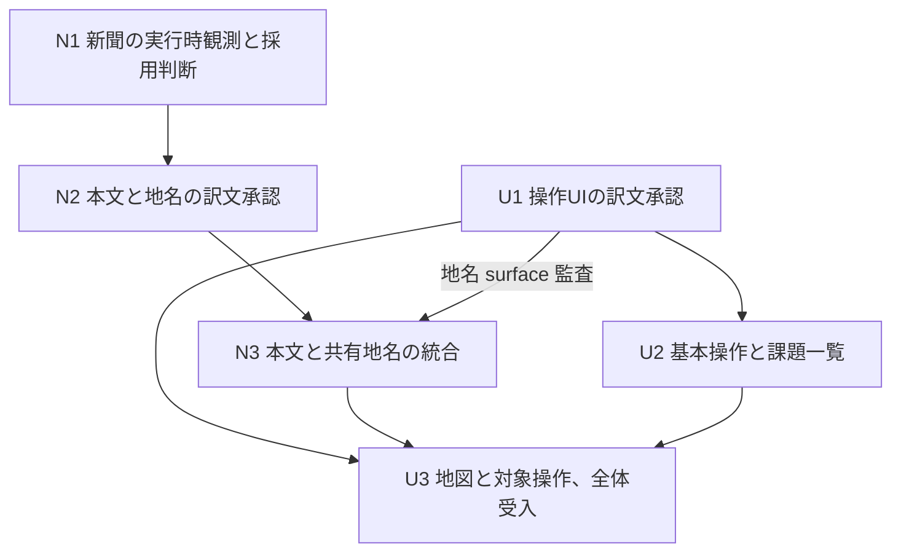

# 2041年の新聞調査と初期 fieldwork UI

- 種別：固定分析と進行中の実行計画
- 分析基準日：2026-09-28 JST
- 分析対象 head：`d898dafaec0f074a3cd66aa70b3cd4916cb57f32`
- 実行計画の最終更新日：2026-10-04 JST
- 実行 root：[Issue #29](https://github.com/5gmt/mind-forever-voyaging/issues/29)

この文書は、新聞を次の候補に選んだ根拠と、着手する作業の責任分担を保存する。
A は9月28日の調査記録として固定し、B は観測、承認、Issue 作成、統合に合わせて更新する。
現在の作業範囲、依存関係、受入条件は B を参照する。
プロジェクト全体の実装済み範囲は [PROJECT_STATUS.md](../../PROJECT_STATUS.md)、不変条件と作業規約は [AGENTS.md](../../AGENTS.md) と [PROJECT_CHARTER.md](../../PROJECT_CHARTER.md) を参照する。

## A. 調査時点の分析

以下は `amfv_project_analysis_and_next_milestone_2026-09-28.md` の分析と候補選定部分を保存した記録である。
参照リンクの表記だけを GitHub Markdown に合わせて整えた。
「現在」「現行」「今回」は2026-09-28の調査時点を指し、二経路の連続プレイはこの時点の提案である。
新聞の実行時観測や実装が済んだことを意味しない。
今後の進捗でこの本文を書き換えず、事実誤認の訂正が必要な場合は日付、根拠、対象箇所を付けて末尾に追記する。

<!-- fixed-analysis-begin -->
**次のまとまりには「2041年の裁判所と新聞を、日本語の案内で回れるフィールドワーク」を推奨する。**
新聞の購入と読書を次の物語上の到達点とし、既に本文の日本語化が進んだ Simulation Mode の基本操作、課題一覧、対象経路の案内を整える。
新聞経路の実行時観測を最初の判断点に置き、本文側の実装範囲はそこで確定する。

判断の根拠は、現行コード、プロジェクト文書、Issue #29 の最新コメント、PR #60、マージ後の GitHub Actions ログである。
今回、ゲームの新規実行、新聞経路の新規 capture、本番 Netlify の画面確認は実施していない。
以下では、リポジトリで確認した事実、そこからの評価、今後の検証が必要な仮説を区別する。

**現在は、既存の作業列を終えて次の目標を選べる状態にある。**

| 確認項目 | 現状 | 計画上の意味 |
| --- | --- | --- |
| 最新マージ | PR #60。日本時間 9月28日 06:19 にマージ | Courthouse の統合レビューを再開する必要はない |
| Open PR | 0件 | 次の実装範囲を新しく選べる |
| Open Issue | #29 と #44 の2件 | #29 は次の到達点の選定、#44 は協働規約の文書化 |
| #29 の最新状態 | Courthouse 完了報告が投稿済み | 完了報告の再投稿は不要 |
| 現行 head の CI | verify、browser-e2e とも成功 | 既存の検証範囲を保ちながら拡張できる |
| 配備方式 | Next.js static export と Netlify | 配備方式変更を次期作業の前提にする理由はない |

Open Issue は検索結果に加えて REST の open 一覧でも確認した。
PR #3 の Sites adapter は未マージで閉じられており、現行 baseline に含まれない。[資料1][1]、[資料2][2]、[資料3][3]

**日本語で体験できる範囲は、導入から最初の市街地調査まで連続している。**

| 領域 | 確認できた到達点 | 未対応、または保証を広げていない範囲 |
| --- | --- | --- |
| 導入 | opening、最初の tableau、LOOK | 後続の章の導入全般 |
| Communications / PEOF | 最初のオフィス、7コマンドの inspection、初回通知へ至る WAIT 列 | 他 outlet の本文、任意の会話、別の時刻条件 |
| Simulation への移行 | 9項目の依頼、security prompt、初回2041年への入場 | 誤答、失敗、再入場、後続年 |
| 最初の録画 | Kennedy Park の LOOK と RECORD → WAIT → RECORD OFF | 課題全体の達成と提出 |
| 市街地 | Kennedy Park → Elm & Park → Courthouse → Kennedy Park の録画往復 | 他の課題、別時刻の裁判所、未承認の街路描写 |
| 周辺 UI | 導入から PEOF までの主要な操作面、package overlay、共有 shell | Simulation 固有の基本操作、地図と経路、課題一覧、ノートの多く |
| 現在地表示 | wrapper 側の Kennedy Park、Elm & Park、Courthouse | その他の地名。raw GridWindow は原文を維持 |

この表の単位は「場面と行動の組み合わせ」であり、ゲーム全体の翻訳率ではない。
分母となる全出力、分岐、年代別の coverage inventory は確定していないため、進捗を百分率にする根拠はない。[資料1][1]、[資料4][4]

Courthouse について保証されているのは、観測済みの録画往復と承認済み本文の表示である。
「原作側が九つの課題すべてを受領し、次の章へ進む」ことはこの milestone の範囲に入らない。
一つの課題に対応する行動を実行できることと、課題完了の原作側評価を検証することは、別の到達点として管理する。

**表示方式の検証が進み、通常の場面を追加する手順が成立している。**

現在の 2a+2b は、Parchment が所有する BufferWindow の中に日本語表示面を置き、通常のターンには観測した行順、段落、空行、入力 run を再利用する方式である。
原作の状態とパーサーは Release 79 が決定し、日本語はその出力から作る。
未承認の本文は原文に戻る。
意味構造が異なる初期画面、9項目の依頼、security prompt には、それぞれ限定した専用処理がある。[資料4][4]、[資料5][5]

Courthouse の追加では、新しい描画方式を必要とせず、観測、訳文承認、既存 catalog への統合で対応できた。
したがって、次の通常場面もまずこの経路で評価するのが妥当である。
新聞の記事が長いことだけを理由に、汎用 renderer、翻訳 framework、VM telemetry を追加する計画にはしない。
実行時の段落、input、window の構造が既存処理で表せないと分かった場合に、該当箇所だけ設計を追加する。

ただし、翻訳の照合は文面と command の一致に強く依存する。
PR #60 では、Elm & Park の描写に未承認の別形が CI 上で現れ、原文に戻すことを回帰検証へ追加した。
これは、場面を一度日本語化すれば、その場所の全出力が日本語になるわけではないことを示す。
別形を観測したら、段落全体の一致を保って追加するか、繰り返し生じる共通問題として照合単位を見直すかを判断する。
現時点で文の一部だけを推測して翻訳する仕組みに広げる必要はない。[資料6][6]

**次の作業を決めるうえで、三つの差を埋める必要がある。**

第一に、本文と操作 UI の到達範囲に差がある。
コードでは Simulation の Look、Record、Inventory、Wait、Abort、Explore、地図、課題一覧が英語のまま残っている。
security の物語側 prompt は日本語化されているが、assisted decoder の操作説明や Submit code は英語である。
日本語の依頼を読んだ直後に、操作のため英語の補助画面へ戻る構成になっている。[資料7][7]、[資料8][8]

これは従来の作業範囲で意図的に保留していた面であり、PR #60 の未完了を意味しない。
今回ここを新たに範囲へ入れると、既存の裁判所本文も使いやすくなる。
承認済みの9項目の訳語を再利用しつつ、本文とボタンで文体が違う箇所は UI 用の copy として確認する。

第二に、表示履歴の復旧と、補助 UI の派生状態の復旧には保証範囲の差がある。
日本語表示履歴は RESTORE 送信時などに破棄して原作の観測へ戻す処理を持つ。
一方、README は発見済みフラグなどを RESTORE / UNDO 後に VM と同じ状態へ厳密に巻き戻す保証が未完成であることを明記している。
fieldwork checklist も原作の RECORDING-TABLE を直接読む方式ではなく、録画中と推定した英語ログを照合する方式である。[資料7][7]、[資料9][9]、[資料10][10]

したがって、新しい受入条件を「チェックが二つ付くこと」だけにしてはいけない。
原作の録画 status、購入と読書の実出力、補助画面の推定結果を別々に確認する。
次の二経路で具体的な食い違いが見つかった場合は、再現例を持つ限定修正を作る。
VM telemetry 全体の導入を先回りして必須作業にする必要はない。
九課題の正式な完了や再入場まで進める段階では、この差を再評価する。

第三に、テストには実際のプレイ範囲に応じた追加が必要である。
現在のマージ後 CI では Node の24テスト、Chromium の19テストが成功している。
Chromium は1 worker、retry 0で動き、今回のログでは19件の実行が約1.5分だった。
この事実は現在の accepted route を支えるが、未実装の長い記事、fieldwork UI、別ブラウザやタッチ操作の保証にはならない。[資料2][2]、[資料11][11]

PR #60 では、同じ RECORD コマンドを再び使った際に、既存の表示を新しいターンの完了と誤認するテスト同期問題も修正している。
新聞のテストでは、履歴全体に文面が存在するだけで先へ進まず、今回追加されたターンと入力復帰を確認する。
これ以上長い手順を既存の巨大なテストへ無制限に継ぎ足さず、新聞用のシナリオを分ける。
共通化は、fresh-session の導入やターン完了待ちなど、新しいシナリオで実際に重複する部分に絞る。[資料6][6]、[資料11][11]

**次の候補は、新聞を中心にすると既存の判断と接続しやすい。**

| 候補 | 得られるプレイヤー体験 | 費用と不確実性 | 推奨順位 |
| --- | --- | --- | --- |
| 新聞の購入と読書、初期 fieldwork UI | 裁判所に続いて社会描写をまとまって読み、日本語の案内で移動と録画を行う | 新しい3地点、購入処理、長文、街路の変動。通常の表示方式で収まるかは capture 待ち | 1 |
| 新聞の本文拡張のみ | 物語の到達点を早く伸ばす | UI の英語が残る。標準3段階で進められる | 容量を絞る場合の縮小案 |
| Communications の1 outlet | 別の場面や人物を見られる | 本筋の調査は進まず、outlet ごとの変動を扱う | 次点 |
| 九課題と原作の評価まで一括 | 最初の調査を完遂し、物語の区切りに達する | 会話、交通、営業時間、録画条件、帰還、評価分岐をまとめて扱う | 次々期以降に分解して着手 |
| security の誤答と失敗 | 操作を誤ったときの連続性を改善する | 通常経路の前進は少ない | 独立した改善候補 |

#29 の Courthouse 選定コメントは、新聞をその後の候補として既に挙げている。
この提案は、そこに初期 Simulation の操作面を組み合わせるものである。[資料15][15]

保存された ZIL では、新聞は Bodanski Square で購入し、2041年に録画しながら READ すると該当する RECORDING-TABLE の項目が更新される。
同じ箇所は読書に10分を割り当て、記事を複数段落で出力する。
これは候補の妥当性と調査すべき分岐を説明する source evidence であり、Release 79 / Parchment で今回の経路を実測した証拠ではない。[資料12][12]

調査開始時の仮説は、既存の Courthouse 往復後、Kennedy Park から Main & Kennedy、Centre & Kennedy を経て Bodanski Square に向かい、新聞を購入して読んだ後、公園へ戻る経路である。
方向の対応も保存 source に基づく。
購入時の持ち物条件や実出力は capture で確認し、観測前に再現手順として承認しない。

| 仮の操作列 | source に基づく候補 |
| --- | --- |
| 往路 | RECORD → NE → N → NE |
| 現地 | BUY NEWSPAPER → READ NEWSPAPER |
| 復路 | SW → S → SW → RECORD OFF |

この段階の到達点は「二つの調査経路の本文と必要な操作を日本語で扱えること」とする。
九課題すべての達成、録画の提出、次章への移行は含めない。
ランダムな街路描写、未承認の反応、parser command、原作の時刻などは、定義した原文表示の境界に従う。
<!-- fixed-analysis-end -->

分析の訂正記録：なし。

## B. 進行中の実行計画

### 採用する範囲と現在の状態

新聞の購入と読書を次の物語上の候補とし、初期 Simulation の基本操作、課題一覧、採用経路の案内を日本語化する六つの作業単位で進める。
計画は [PR #61](https://github.com/5gmt/mind-forever-voyaging/pull/61) で保存した。
N1〜N3、U1〜U3 の Issue は下表の6件として作成済みである。N1 は Issue #62 として runtime capture と review を完了し、二つの fresh canonical session に基づいて A（同一 session の裁判所 → 新聞）を採用した。詳細は [runtime evidence](../newspaper-runtime-evidence.md) を参照する。N2 は [copy packet](../newspaper-copy-packet.md) の review を完了した。U1 も [初期 Simulation UI copy packet](../initial-simulation-ui-copy-packet.md) の review を PR #72 で完了した。U2 は [PR #76](https://github.com/5gmt/mind-forever-voyaging/pull/76) で再レビュー承認とマージを完了した。N3 は両方の承認済み成果を使い、exact observed newspaper leaves、共有 room-name lookup、room と異なる map identity 用 adapter を production に統合した。
同一 session で裁判所から新聞へ進むことを、後続の採用経路と最終受入単位にする。新聞本文の production integration は PR #74（N3）で完了した。U3 は map / route / context exit / 新聞 SceneActions を統合し、[採用案 A の全体受入記録](../issue-67-fieldwork-acceptance.md) を本 PR に集約する。指名レビュー担当の確認とマージまでは milestone 完了を保留する。

対象は初回2041年の既存 Courthouse 往復、N1 で採用する新聞経路、そのために必要な操作面である。
九課題すべての本文、原作側の正式な課題達成、帰還と評価、再入場、後続年、ノート、比較画面、他 outlet は今回の範囲に含めない。
原作マップ画像の描き直し、経路探索アルゴリズムの変更、日本語 parser、runtime machine translation、VM telemetry 全体の導入も対象外とする。
ボタンや九つの課題名を訳すことと、その後に返る全本文へ対応することは区別する。

### 六つの作業票と担当

N1 などの ID は文書内の固定 ID であり、GitHub Issue 番号ではない。
Issue の実リンクは下表に記録した。
実装担当とレビュー担当を決定したら、この表と各 Issue を更新する。
着手前に各担当を具体化し、U3 の担当には最終統合の責任も引き渡す。
役割の責任は以下で固定するが、未割当の人物やエージェントを割当済みとは扱わない。

| ID / 作業票タイトル | 成果物と責任 | 開始条件 / 依存関係 | Issue / 実装担当 / レビュー担当 | 状態 |
| --- | --- | --- | --- | --- |
| N1 Runtime: capture the 2041 newspaper fieldwork route | canonical fixture、再現 script、観測メモ、採用案と縮小判断。本計画と status の判断点を更新する | なし | [#62](https://github.com/5gmt/mind-forever-voyaging/issues/62) / ChatGPT / 5gmt | 完了（PR #69） |
| N2 Copy: approve Japanese copy for 2041 newspaper fieldwork | [exact English leaf と日本語本文、共有地名の正本、翻訳対象外の一覧](../newspaper-copy-packet.md) | N1 の観測と終了判断のレビュー完了 | [#64](https://github.com/5gmt/mind-forever-voyaging/issues/64) / ChatGPT / 5gmt | 完了（PR #70） |
| N3 Integrate the 2041 newspaper fieldwork in Japanese | 本文 catalog、共有地名対応表と lookup、現在地表示、unit と新聞 E2E。新聞本文の実装範囲を status に記録する | N2 完了と U1 の地名 surface 監査の review 承認。必要な専用表示があれば、その設計承認も必要 | [#66](https://github.com/5gmt/mind-forever-voyaging/issues/66) / ChatGPT / 5gmt | 完了（PR #74、再レビュー承認・マージ済み） |
| U1 Copy: approve the initial Simulation fieldwork controls | [画面別の英日 copy、visible / accessible name、command、動的値の台帳](../initial-simulation-ui-copy-packet.md)。U2 と U3 の担当範囲を項目ごとに分ける | なし。新聞固有部分は完了した N1 / N2 と照合する | [#63](https://github.com/5gmt/mind-forever-voyaging/issues/63) / ChatGPT / 5gmt | 完了（PR #72） |
| U2 Localize initial Simulation controls and the recording brief | 入場 CTA、assisted decoder の説明、基本操作、初期案内、課題一覧の copy を統合する | U1 packet の U2 部分の review 承認。新聞固有部分を含めない | [#65](https://github.com/5gmt/mind-forever-voyaging/issues/65) / ChatGPT / 5gmt | 完了（PR #76、PR #75・#73 を置換）。canonical session の初回状態を QA の観測から分離し、QA 往復後も初回2041年の日本語 UI を維持する。真の再入場と RESTORE は English fallback を維持し、U3 へ drawer / checklist の統合結果を引き渡す |
| U3 Localize navigation and accept the 2041 fieldwork milestone | 地図、採用経路、必要な対象操作を統合する。採用案全体の受入と status の最終集約を担う | U1 packet の U3 部分の review 承認、N3 と U2 のマージ完了 | [#67](https://github.com/5gmt/mind-forever-voyaging/issues/67) / Codex（ChatGPT） / ChatGPT Work（unknown） | 本 PR に実装・全体受入証拠を集約。U1 承認済み、N3 は PR #74・U2 は PR #76 でマージ済み。指名レビュー担当の受入確認待ち |

N1 の候補ファイルは `scripts/capture-newspaper-runtime.mjs`、`tests/fixtures/parchment-newspaper-runtime-observed.json`、`docs/newspaper-runtime-evidence.md` である。
N2 は新規 copy packet を作り、production code を変更しない。
N3 は主に `app/localization.ts`、現在地の表示、`tests/rendered-html.test.mjs`、新聞用 E2E を変更する。
U1 は `app/PrismEdition.tsx` と `app/StoryTools.tsx` の実際の表示枝を監査する。
U2 と U3 はこの二つの画面ファイル、担当する UI catalog、対応する E2E を変更する。
新規ファイル名は候補であり、既存の Issue 番号を含む命名に合わせる場合は作業票へ確定名を記録する。

N1 と U1 の既存 UI 監査は並行できる。
U1 の新聞固有 copy は N2 と照合するが、U2 の既存操作 copy の承認を止める理由にはしない。
N3 と U2 は同じファイルを変更しうるため、先にマージされた変更へ後続を追従させる。
共有データの担当は次節で定め、マージ順だけに責任分担を委ねない。
この依存表と図は、後述の A〜C で新聞を採用する場合の計画である。
D で新聞を保留して U3 を既存裁判所向けに縮小する場合は、N3 への依存を外す条件と代わりに用いる既承認 copy を計画改訂に記録する。

### 地名の正本、対応表の追加担当、再利用側

既存の地点表示は `app/localization.ts` の `SIMULATION_PLACE_LABELS` と `localizeSimulationPlace(locale, canonicalPlace)` を使う。
これは exact canonical room name を受け取り、未承認の名前を原文へ戻す lookup である。
今回もこの仕組みを共有する。

| 対象 | 訳語の正本 | production code の追加担当 | 再利用する側 |
| --- | --- | --- | --- |
| 既承認の Kennedy Park、Elm & Park、Courthouse | [初回 Simulation copy](../issue-49-first-simulation-copy-packet.md) と [Courthouse copy](../issue-56-courthouse-copy-packet.md) | N3 が既存値の継続使用を確認する。再翻訳しない | N3 の本文と現在地、U3 の地図と経路 |
| N1 で採用した経路の新しい地名 | N2 の地名表。canonical room ID、exact English label、表示上の役割、訳語、観測と承認の参照を記録する | **N3 が共有地名対応表と lookup の唯一の追加担当**となる | U3 は同じ lookup を呼ぶ。別の地名辞書を作らない |
| 地図上の固有名で、room name と異なるラベル | U1 が確認した既存 UI label を N2 の地名表へ渡し、表示役割と exact identity を別行で承認する。採用対象外は原文のまま | 必要な追加 lookup や adapter も N3 が担当する | U3 は承認済みの表示 identity で利用する |
| 地図の共通操作、課題ラベル、対象物と動詞 | U1 の画面別 copy。既存の課題用語と N2 の本文用語を参照する | U2 は基本操作と課題一覧、U3 は地図と対象操作の UI 項目を担当する | 同じ項目を両 PR で追加しない |

Story heading は N2 の地名訳を使うが、照合には引き続き command と exact observed leaf を使う。
Room ID や現在地を理由に未観測の story leaf を翻訳したり、raw `GridWindow` の値を書き換えたりしない。
N3 は本文 heading、現在地、U3 へ渡す表示 copy の一致を検証し、英語と未知の地名の fallback も確認する。

地図の `targetId` が同じであることは、ラベルが同義であることを意味しない。
現行 `ROCKVIL_LANDMARKS` では `Newspaper` と `North Central Station` がともに `BODANSKI-SQUARE` を指す。
`Newspaper` は課題ラベルとして U1 が扱い、駅名や広場名への置換は行わない。
同様に `InfoTech Building` を、到着先の `Main & Kennedy` と同じ訳語へ置き換えない。
U3 は表示役割に適した既存ラベルを保ち、未承認のラベルには canonical English を残す。

U1 は N3 の着手前に、U3 が使う地名 surface と lookup の入力を洗い出して N2 / N3 へ渡す。
N3 のマージ後に追加の地名が必要になった場合も、N2 の正本と N3 担当の共有表更新を先に行う。
U3 が独自に訳語を足して依存を飛ばすことはしない。
これによって `app/localization.ts` を共有していても、地名データと各 UI 項目の変更責任が明確になる。

### N1 の観測と終了判断

**N1 終了判断（2026-09-29）:** A（裁判所 → 新聞）を採用する。二つの fresh session で連続経路、wallet、購入、記事四段落、帰着、録画停止、入力復帰が成立した。記事は既存 ordinary-turn projector で表現可能で専用表示は不要である。B は縮小不要、C は順序依存の根拠なし、D は追加の状態管理なしで再現したため不採用とする。N2 / N3 / U3 は同一 fresh session の連続経路を受入単位にする。

N1 は購入と読書の成功だけでなく、後続が実装する経路と受入単位を決める。
最初に既存 Courthouse 往復の後で新聞経路を実行する仮説を検証し、失敗した場合は入力待ちの誤認、optional prose の差、canonical な時刻や持ち物条件を切り分ける。
原文 fallback を許容する optional city noise の差だけで、連続経路を不成立とは判定しない。
同じ command の古い出力を拾うテスト同期の問題も、原作側の経路失敗と区別する。

採用する経路は二つ以上の独立した fresh canonical session で最初から観測する。
Fresh entry、security、時刻、持ち物などの前提、全 command、各 turn の status / input、購入、録画中の読書、記事の全段落、帰着、録画停止、入力復帰を記録する。
失敗した試行とその条件も残し、成功する乱数が出るまでやり直して再現性を主張しない。
履歴に文字列が存在することだけを完了条件にせず、今回の turn と入力復帰を確認する。

| 終了案 | 判断条件 | 後続の採用範囲と受入単位 |
| --- | --- | --- |
| A：裁判所 → 新聞を連続して扱う | 上記の連続経路が複数 fresh session で成立し、失敗例も含めて必要条件を説明できる | N2 / N3 は観測済み新聞経路を統合する。U3 が同一 fresh session の裁判所 → 新聞を通して受入する |
| B：別 session の新聞対応を先行する | 連続経路は時刻や状態条件で不安定だが、fresh entry から新聞単独の往復は複数 session で成立する。C の根拠がない、または逆順でも成立しない | **既定の縮小案**とする。裁判所と新聞を別々の fresh session で検証し、同一 session の連続対応を完了条件から外す。連続対応は未解決として記録する |
| C：新聞 → 裁判所へ順序を変える | 失敗原因を順序依存と特定でき、逆順なら解消すると示す source と runtime の根拠がある。逆順全体を複数 fresh session で観測できる | B を採る前に、この条件が揃う場合だけ逆順案を比較する。採用時は N2 / N3 の context と U3 の連続受入順を変更する。既存 Courthouse 単独の保証は維持する |
| D：新聞候補を保留して再選定する | 新聞単独の必要条件や再現性を確立できない、または成立に帰還、再入場、別課題、広い状態管理改修などの追加範囲が必要になる | N2 / N3 と新聞向け U3 は開始しない。証拠と未解決条件を #29 に戻す。U1 / U2 の既存初期 UI は進められる。既存裁判所向けに U3 を縮小する場合も、受入範囲を先に改訂する |

実行環境の障害で観測できない場合は「N1 未完了」と記録し、D の候補不適合とは混同しない。
逆順の探索は、順序依存の根拠が得られた場合に限る。
新しい候補を総当たりで試す作業へ広げず、A が成立しなければ新聞単独の再現性を確かめ、C の条件が揃わない限り B を推奨する。

記事の表示構造が既存の ordinary-turn projector に収まるかも N1 の判定事項とする。
限定した専用表示が必要なら、観測と必要な表示契約を記録して別途設計をレビューする。
その追加作業を承認するまで N3 は開始せず、六つの作業へ未見積もりの renderer 改修を埋め込まない。

N1 担当は、採用を推奨する A〜D、採用経路、前提条件、試行結果、採用しなかった案の理由、ordinary-turn で扱えるか、後続への範囲差分を観測文書へまとめる。
#29 に判断と根拠を記録し、指名したレビュー担当による採用確認へのリンクを残す。
N1 の文書 PR で本計画と `PROJECT_STATUS.md` を更新し、そのレビューとマージを終えてから N2 を開始する。
これを N1 の終了条件とし、capture 成功だけで後続を開始しない。

### Copy と実装の境界

N2 の story copy は runtime fixture に存在する exact English leaf だけを承認し、保存 ZIL にしかない本文を補わない。
記事を要約せず、数値、引用、段落間の関係、政治的、社会的な語り口を保持する。
未承認の street variant、未知の反応、動的な原作情報は原文のまま残す。

U1 は visible label、accessible name、動的値、送信する既存 English command、初期2041年以外の表示を surface ごとに記録する。
Assisted decoder の説明は翻訳しても、Classic や story 本文へ computed answer を出さない。
U2 の課題一覧は既承認の九項目の訳語を再利用し、補助 checklist の推定を原作側の正式な完了と表現しない。
共通の drawer header、tabs、課題一覧の行と accessible name は U2、地図内の経路表示と対象操作は U3 が持ち、U1 の台帳へこの分担を記録する。
地名を含む U2 の surface は既存 lookup を再利用し、新規地名の追加は N3 に委ねる。

U3 は Guided の編集可能な入力案と Action menus の送信 command を保つ。
地図上のクリック、経路の一歩進む操作、必要な SceneActions から検証し、command を手入力する本文 E2E だけで UI 操作まで検証済みとはしない。
未知の地点と対象、経路を決められない状態には既存の原文表示や案内を維持する。

### U3 が担う全体の受入

**最終統合と全体受入の担当 PR は U3 に固定する。**
U3 の実装担当は、N3 と U2 がマージされた最新の `codex/modern-amfv` を取り込み、N1 で採用した案について以下の受入結果を一つの PR に記録する。
N3 の本文テスト、U2 の操作テスト、U3 の地図テストが個別に通っただけでは milestone 全体の完了にしない。
独立した七つ目の受入 Issue は作らない。

| 受入対象 | U3 が記録する確認 |
| --- | --- |
| 採用したプレイ単位 | A は裁判所 → 新聞、C は新聞 → 裁判所を同一 fresh session で通す。B は両経路をそれぞれ別の fresh session で通し、連続対応を主張しない。D は新聞を含む完了判定を行わない |
| 本文と操作方式 | 採用経路を Classic / Guided で通す。変更した地図と Action menus は各 UI から操作し、canonical English command と入力復帰を確認する |
| 長い記事 | 観測した全段落と順序を保つ。Desktop Chromium と狭い viewport の実ブラウザで、読了前の強制スクロール、入力の隠れ、focus の喪失、二重読み上げがないことを確認する |
| Locale と履歴 | 記事表示後の EN → JA → EN で本文、履歴、入力、focus を保持する。既存の表示履歴と RESTORE-safe fallback の回帰を維持する |
| 地名とラベル | N2 の正本と N3 の対応表を全 surface で再利用する。同じ targetId の異なる landmark label を混同せず、未知値と未承認 leaf は英語で残す |
| 録画と補助進捗 | 原作の recording status、購入と読書の実出力、補助 checklist の推定を別々に確認する。二つのチェック印だけで受入しない |
| 保持する原作境界 | canonical artifact の SHA-256 は `14e2fd1872c9487e2ca51a7975590358f5ca42a4b439abc39c60b6653511216d`。状態認識は raw English、parser command は English。`source/` と raw `GridWindow` は変更しない |
| 実装時の検証 | `npm run lint`、`npx tsc --noEmit`、`npm test`、`npm run test:e2e` と checksum を最新 head で確認する。ブラウザ観測、既知の制限、CI 結果を PR に残す |
| 完了記録 | U3 が本計画と `PROJECT_STATUS.md` を実際に提供した範囲へ更新し、採用案、証拠、保留事項を #29 に戻す。レビュー担当が全体受入と status の整合を確認する |

追加 UI の進捗表示や復元に食い違いが見つかった場合、再現例を保存し、表示の問題か誤った command 提案かを切り分ける。
必要な修正と回帰確認を終えるまで当該範囲の受入を保留する。
配備済み版について確認する場合は commit と対象経路の確認結果を記録し、GitHub の CI 成功だけで Netlify 本番の一致を断定しない。

範囲縮小で U3 の地図変更を取り下げても、全体受入の責任は自動では他の PR へ移らない。
原則として U3 を残して採用範囲の受入と文書の集約を行う。
U3 自体を中止する場合は、代わりに担当する具体的な Issue / PR と担当者を本計画と #29 に記録し、そのレビューを済ませてから残りの作業を完了扱いにする。

### 更新責任と判断記録

A の分析本文は固定し、B の Issue 対応表、担当、依存関係、採用案、受入結果を更新する。
各 PR の担当者は、提供範囲や frontier が変わるときに同じ PR で `PROJECT_STATUS.md` を更新する。
Issue 上だけの承認で依存が変わる場合も、後続実装より前に文書 PR をマージするか、規約に従って担当する具体的な次の PR を指定する。
N1 の採用判断は前節のとおり N1 の文書 PR に保存し、U3 が最終的な完了範囲を集約する。
`PROJECT_STATUS.md` の最終確認日は、全体を default branch と照合した場合だけ更新する。
[Issue #44](https://github.com/5gmt/mind-forever-voyaging/issues/44) の協働規約の文書化は、この六つの依存関係から独立して扱う。

| 日付 | 判断 / 変更 | 根拠 / 結果 | 更新担当 |
| --- | --- | --- | --- |
| 2026-09-28 JST | 新聞本文と初期 fieldwork UI を次の候補にした | A の固定分析。新聞経路は source evidence に基づく仮説 | 分析作成者 |
| 2026-09-29 JST | 地名の正本を N2、対応表の追加を N3、再利用を U3 に分担。最終受入を U3 に固定し、N1 の A〜D 判断を追加した | 計画レビューの三指摘を反映。head は引き続き `d898dafa`。実装 Issue は未作成 | この計画を保存する文書 PR の担当 |
| 2026-09-30 JST | PR #61 のマージ後、六つの作業票を作成して相互参照を確定した | N1 [#62](https://github.com/5gmt/mind-forever-voyaging/issues/62)、N2 [#64](https://github.com/5gmt/mind-forever-voyaging/issues/64)、N3 [#66](https://github.com/5gmt/mind-forever-voyaging/issues/66)、U1 [#63](https://github.com/5gmt/mind-forever-voyaging/issues/63)、U2 [#65](https://github.com/5gmt/mind-forever-voyaging/issues/65)、U3 [#67](https://github.com/5gmt/mind-forever-voyaging/issues/67)。担当は着手前に具体化し、N1 の採用判断は未実施 | 作業票作成担当（ChatGPT） |
| 2026-09-29 JST | N1 は A（裁判所 → 新聞）を推奨 | 二つの fresh session で連続経路が成立。記事は ordinary-turn 適合、専用表示不要。Issue #62 の PR で 5gmt のレビュー待ち | ChatGPT |
| 2026-10-03 JST | N1 の PR #69 マージを受けて N2 の copy packet を作成 | Fixture の stable leaf、記事四段落、共有地名、U1 へ渡す役割別 map identity、English fallback 境界を記録。5gmt の copy review 後に N3 / U1 へ引き渡す | ChatGPT（作成）/ 5gmt（レビュー） |
| 2026-10-04 JST | U1 の PR #72 承認を受け、N3 が新聞本文と共有地名を production に統合 | Exact command / leaf catalog、room-name lookup、役割別 map-label adapter、unit / Classic / Guided browser regression を追加。map / route UI と全体受入は U3 に残す | ChatGPT（実装）/ 5gmt（レビュー） |
| 2026-10-04 JST | U1 の PR #72 で承認された U2 copy を初期 Simulation UI に統合 | 入場 CTA、assisted decoder、基本操作、初期 fieldwork launcher、drawer 共通 header / tabs、九課題と補助推定 copy を英日 catalog から表示する。送信 command は canonical English のまま維持し、地図内の経路・対象操作は U3 に残した | ChatGPT（U2 実装） |
| 2026-10-07 JST | PR #74 の受入補強と最新 base 追従 | U2 は PR #76 で完了。N3 の録画 turn 同期、記事全文・scroll・accessibility のブラウザ証拠を補強し、U3 は N3 マージ待ちとする | Codex（修正）/ 5gmt（再レビュー） |
| 2026-10-08 JST | N3 完了へ同期、U3 の地図・対象操作と全体受入を統合 | 採用案 A、[統合受入記録](../issue-67-fieldwork-acceptance.md)、U3 draft PR と #29 に検証結果・制限を集約する。指名レビュー担当の確認まで milestone 完了は保留 | Codex（実装）/ ChatGPT Work（unknown、受入レビュー） |

## 固定分析の参照資料

[1]: https://github.com/5gmt/mind-forever-voyaging/blob/d898dafaec0f074a3cd66aa70b3cd4916cb57f32/PROJECT_STATUS.md
[2]: https://github.com/5gmt/mind-forever-voyaging/actions/runs/36351267430
[3]: https://github.com/5gmt/mind-forever-voyaging/issues/29#issuecomment-5859926210
[4]: https://github.com/5gmt/mind-forever-voyaging/blob/d898dafaec0f074a3cd66aa70b3cd4916cb57f32/PROJECT_CHARTER.md
[5]: https://github.com/5gmt/mind-forever-voyaging/blob/d898dafaec0f074a3cd66aa70b3cd4916cb57f32/docs/localization-boundary.md
[6]: https://github.com/5gmt/mind-forever-voyaging/pull/60
[7]: https://github.com/5gmt/mind-forever-voyaging/blob/d898dafaec0f074a3cd66aa70b3cd4916cb57f32/app/PrismEdition.tsx
[8]: https://github.com/5gmt/mind-forever-voyaging/blob/d898dafaec0f074a3cd66aa70b3cd4916cb57f32/app/StoryTools.tsx
[9]: https://github.com/5gmt/mind-forever-voyaging/blob/d898dafaec0f074a3cd66aa70b3cd4916cb57f32/README.md
[10]: https://github.com/5gmt/mind-forever-voyaging/blob/d898dafaec0f074a3cd66aa70b3cd4916cb57f32/app/presentation-history.ts
[11]: https://github.com/5gmt/mind-forever-voyaging/blob/d898dafaec0f074a3cd66aa70b3cd4916cb57f32/tests/e2e/first-simulation-localization.spec.ts
[12]: https://github.com/5gmt/mind-forever-voyaging/blob/d898dafaec0f074a3cd66aa70b3cd4916cb57f32/source/rockvil.zil
[13]: https://github.com/5gmt/mind-forever-voyaging/issues/44
[14]: https://github.com/5gmt/mind-forever-voyaging/blob/d898dafaec0f074a3cd66aa70b3cd4916cb57f32/source/prism.zil
[15]: https://github.com/5gmt/mind-forever-voyaging/issues/29#issuecomment-5842848716

- [現行状況][1]
- [マージ後 CI][2]
- [Issue #29 の完了報告][3]
- [プロジェクト憲章][4]
- [表示方式の責任分界][5]
- [最新の統合 PR #60][6]
- [主要画面と状態認識][7]
- [地図と操作コンポーネント][8]
- [README の保証と既知の制限][9]
- [表示履歴の照合と回復][10]
- [初回 Simulation と Courthouse の E2E][11]
- [新聞と移動に関する保存 source][12]
- [協働規約 Issue #44][13]
- [録画評価に関する保存 source][14]
- [Issue #29 の Courthouse 選定と新聞の位置づけ][15]
